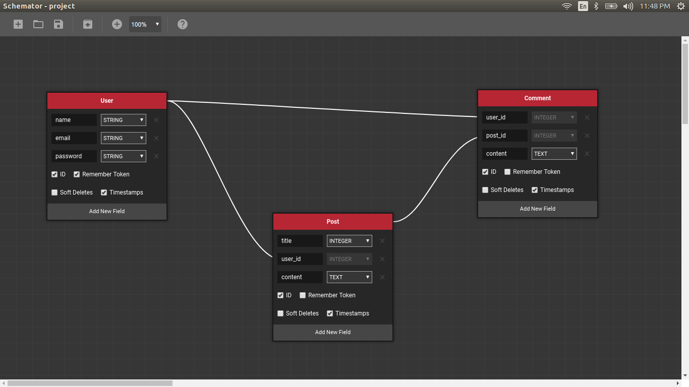

# Schemator

Prototype your scheme quickly and export it to Laravel model and migration.

## Installing

1. Download [here](https://github.com/gattigaga/schemator/releases/tag/1.0.0) (Sorry, I can't pay Chrome Web Store submission fee).
2. Open Extensions page in Google Chrome Browser.
3. Drag and drop to it.
